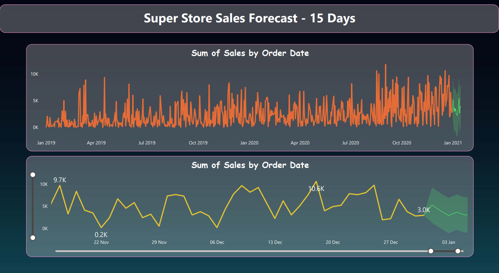

# Super Store Sales Analysis & Forecasting Dashboard

This project presents an interactive sales dashboard for "Super Store" built using Microsoft Power BI. The dashboard provides a comprehensive overview of the store's performance by analyzing sales data across various dimensions like region, customer segment, product category, and time periods. It also includes a 15-day sales forecast to aid in strategic planning. The initial data cleaning and preparation were performed using Microsoft Excel.

***

## Key Performance Indicators (KPIs)

The dashboard highlights the top-level business metrics, providing an at-a-glance view of the overall performance:
* **Total Sales**: $1.57M
* **Total Profits**: $175.26K
* **Total Quantity Sold**: 22K

***

## Dashboard Features & Visualizations

The dashboard comprises several visualizations to provide detailed insights into the sales data.

### Sales Breakdowns
* **Sum of Sales by Segment**: A donut chart illustrating the sales contribution from different customer segments.
    * **Consumer**: 48.09%
    * **Corporate**: 32.55%
    * **Home Office**: 19.35%
* **Sum of Sales by Payment Mode**: A donut chart showing the popularity of different payment methods.
    * **COD (Cash on Delivery)**: 42.62%
    * **Online**: 35.38%
    * **Cards**: 21.99%
* **Sales by Category**: A bar chart comparing sales performance across the main product categories:
    * Technology
    * Furniture
    * Office Supplies
* **Sales by Sub-Category**: A bar chart highlighting the top-performing product sub-categories.
    * **Phones**: $0.64M in sales
    * **Chairs**: $0.47M in sales
    * **Binders**: $0.45M in sales
* **Sales by Ship Mode**: A bar chart that displays the sales volume distributed among various shipping methods, including Standard Class, Second Class, First Class, and Same Day.

### Time-Series Analysis and Forecasting
* **Monthly Sales and Profits by YoY**: Line charts provide a year-over-year comparison of monthly sales and profits for 2019 and 2020, allowing for the identification of seasonal trends and annual growth.
* **Super Store Sales Forecast - 15 Days**: A line chart visualizes the sum of sales by order date from January 2019 to January 2021 and projects sales for the next 15 days, enhancing predictive insights for strategic planning.

***

## Key Insights
* **Top Customer Segment**: The **Consumer** segment is the largest contributor to revenue, accounting for 48.09% of total sales.
* **Preferred Payment Method**: **Cash on Delivery (COD)** is the most popular payment method among customers, making up 42.62% of sales.
* **High-Value Categories**: **Technology** and **Furniture** are the leading categories in terms of sales revenue. Specifically, **Phones** are the highest-selling sub-category with $0.64M in sales.
* **Regional Analysis**: The dashboard is equipped with filters to analyze and compare sales performance across four distinct regions: **Central**, **East**, **South**, and **West**.

***

## Tools and Technologies
* **Data Cleaning and Preparation**: Microsoft Excel
* **Data Visualization and Dashboarding**: Microsoft Power BI

***

## How to Use the Dashboard
1.  **Select a Region**: Use the slicers for Central, East, South, or West to filter the entire dashboard for region-specific data.
2.  **Analyze Trends**: Hover over the line charts to see specific sales and profit figures for each month in 2019 and 2020.
3.  **Explore Details**: Interact with different chart elements (like segments or categories) to cross-filter other visuals and drill down into the data.
